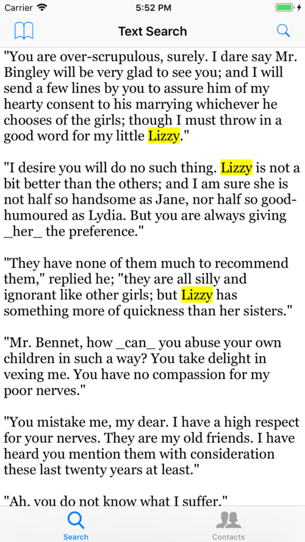
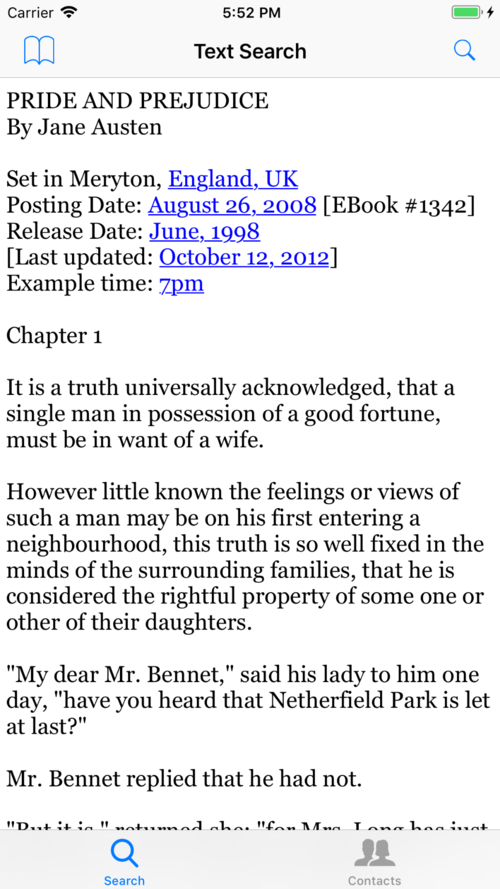

# Swift4-NSRegularExpression-Tutorial-Getting-Started
Swift4 version updated :NSRegularExpression Tutorial: Getting Started

## This is a repo for [NSRegularExpression Tutorial: Getting Started](https://www.raywenderlich.com/86205/nsregularexpression-swift-tutorial).

### The code is posted on  January 21, 2015 by [James Frost](http://jamesfrost.co.uk)

##### the first release v1.0 is the start project

##### the first release v2.0 is the final project

Thanks for the good work of Ray Wenderlich.

### Image Description:

#### /Search( and replace)?/

#### Handling Multiple Search Results

### My name is JiangZhou Deng, DNG for short. I am an iOS developer in Shanghai, China.

#### I am pleased to do a little heloping others. And thanks for the good work of Ray Wenderlich.

## May what I give is more than what I receive.
